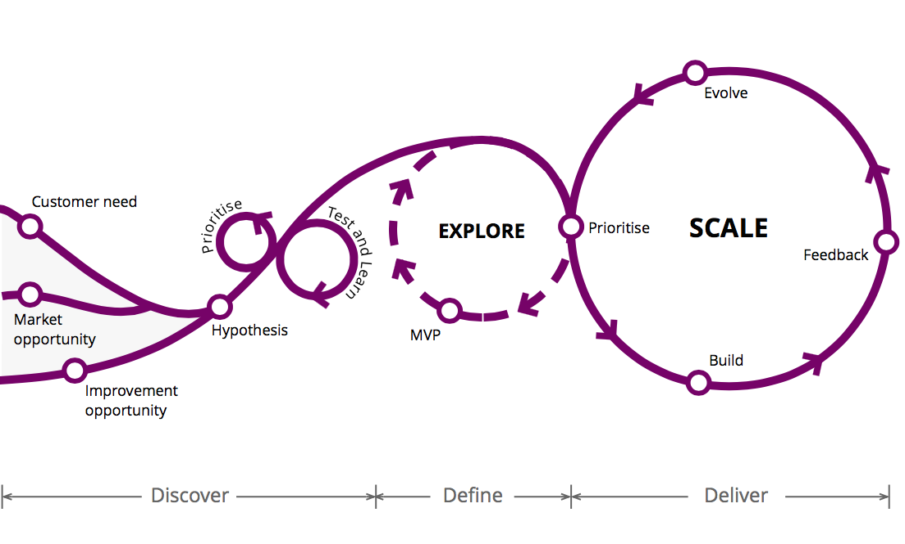

# PLAYBOOK

Here we describe how we run our company, how we plan our work, program our softwares and ensure their quality. This document is based in our experience, but also in the experience and study of others and is always evolving when we find a better way to do things.

> No matter the circumstance you can always improve. You can always start improving with yourself. You can always start improving today.
>
> -- Kent Beck, Extreme Programming Explained

Everyone in Magrathea can edit this playbook by simply opening a PR (pull request) with the desired modifications. In this way, we can discuss all modifications through the PR and keep the discussion archived for future references.

**Summary**

* [Our Company](#markdown-header-our-company)
* [Project and Planning](#markdown-header-projects-planning)
* [Development](#markdown-header-development)
* [Design](#markdown-header-design)
* [General Guidelines](#markdown-header-general-guidelines)
* [Operations](#operations)
* [References](#markdown-header-references)

## OUR COMPANY

> [...] the future is already here — it’s just not very evenly distributed.
> -- William Gibson

We are here to help organizations improve their productivity and to prepare people for the future that is already here.

We are passionate about the unknown and by solving problems with technology.

We want to be recognized as the bests at solving problems using Artificial Intelligence and good Software Engineering practices. We know how to create minimal viable products and also complete solutions through a systemic vision and good business understanding. We know how to communicate and how to sell what our customers need.

### PURPOSE

Why Magrathea Labs exists?

Our purpose is to *transform the future into the present*.

We want to do this solving our customers challenging problems using technology in an effective and innovative way by designing and engineering software systems and data analysis using Artificial Intelligence.

### PRINCIPLES

*We care*. We don't say "I told you." We don't say "this is not my responsibility."

*We are actively transparent*. We actively communicate. We share the problems with each other.

*We are a team*. We share responsibilities. We don't let our egos take control of us. We win and lose together. We don't have positions; we have roles. We could disagree with each other, but we commit to the team.

## PROJECTS PLANNING

> Plans are nothing; planning is everything.
>
> -- Dwight D. Eisenhower

> [...] as we know, there are known knowns; there are things we know we know. We also know there are known unknowns; that is to say we know there are some things we do not know. But there are also unknown unknowns - the ones we don't know we don't know [...]
>
> -- [Donald Rumsfeld](https://www.wikiwand.com/en/There_are_known_knowns)

It is important to write plans and projects. In any form and size a plan provides a framework to organize the neural pathways in your mind and to make the raw information available in an accessible way to the rest of the team in a way to have a future reference. But do not stick to a plan. A plan does not capture everything. Changes happen all the time and unfortunately a plan usually fails to capture the randomness of life.

All projects are specified in PRDs (**P**roduct **R**equirements **D**ocuments) in our [Google Drive Projets folder](https://drive.google.com/drive/folders/0B6m7dowklNjvUTVIcURiazBoM2s).

All projects have some accompaniment docs:

* [Commercial Proposal](https://docs.google.com/document/d/1sESbIJ_I53wYpENJo8iZU5TcdfZK8tZlzEwkfzPj4_w/edit);
* [Project](https://docs.google.com/a/magrathealabs.com/document/d/1IU_-NaHIaXniNpa-qpl_55tIdeLmi5TYVDpbrSTc-jk/edit);
* [Contract](https://docs.google.com/a/magrathealabs.com/document/d/1Xhk0-s2k5ONhC2Z8gpXpPzlFagnDH7Y7D208jq-D69U/edit);
* [Project Completion Term](https://docs.google.com/document/d/1KF3qVysLKTRBIS8-f6dxW64N-HyatC_UplUtzBDyrwM/edit);
* [NDA](https://docs.google.com/document/d/1lY-N5sT8BX-YWKflEqt-m1HPdY5rzS02g1cIB6WtSfE/edit).

We start the project with the commercial proposal, with a broad vision of the project's estimatives and costs. We write this document to start negotiating with our customers. Them, we write the project, with requirements and functional specs. The project document is attached with the contract. When finishing a project, we give to our customer the project completion term, where we list what we have done and ask for feedback about our work. In some projects we also use a special NDA documents.

We like to work in phases, iterating with customers to prioritise, test and learn about what we're doing. We implement MVPs to explore the potential of our ideas, scaling the good ones that worked:

[Reference: Thoughtworks](https://www.thoughtworks.com/insights/blog/10-tips-transformation-guide-pioneers)

## SOFTWARE DEVELOPMENT

Most of our development practices are detailed in the Kent Beck's [Extreme Programming Explained: Embrace Change](https://www.goodreads.com/book/show/67833.Extreme_Programming_Explained) and Uncle Bob's [Clean Code](https://www.goodreads.com/book/show/3735293-clean-code) books. We have tried their practices and found that using most of them improves the quality of our work.

### Documentation

Clear communication is a core of our development process. We believe it is a matter of proper documentation to register all steps of the way when making software. A proper documentation allows software to be easily maintainable by other and even by ourselves when we deal with code that was made some time ago.

However, to have a good documentation does not mean we will write long comments at the side of each line of code. Moreover, it does not mean we will have long messages in the commits explaining each little change in the software. Therefore the documenting must be done at a right amount and in an organized manner.

### Project Management

Our software projects are managed on [Pivotal Tracker](https://www.pivotaltracker.com). This space is used to specify features and bugs (including all steps to reproduce them), and another discussion that must happen before coding.

For each feature, we write a story with a subset of tasks. We always try to break the stories in the smallest possible pieces to deliver value to the user of the system. Stories are estimated using the Fibonacci sequence:

* **0 points**: trivial (~10 minutes);
* **1 point**: 1/4 day of work;
* **2 points**: 1/2 day of work;
* **3 points**: 1 day of work;
* **5 points**: 2~3 days of work (should be split into smaller tasks);
* **8 points**: 1 week of work (should be split into smaller tasks).

For each set of features, we add a milestone with a due date. We deliver one or more milestones per iteration. We negotiate with our customers what features and in what order they will be delivered in each milestone.

When working on a big feature, we use epics to associate multiple related stories and milestones that are part of the high-level feature.

Mostly, we use the Pivotal Way to write [stories](https://medium.com/product-labs/principles-to-effective-story-writing-the-pivotal-labs-way-76da56031f82).

### Coding

All code must be understandable. That is a clean code principle in which we believe. We avoid commentaries in all cases, except when they are essential.

#### Version Control

We use Git open source code control to manage our code and GitHub for hosting our Git repositories.

The commits messages should point out objectively what changes were made to the system using preferably bullet points. The messages should be clear and concise so that other programmers can look it up quickly. More good practices about commit messages can be found at [tpope's blog](http://tbaggery.com/2008/04/19/a-note-about-git-commit-messages.html).

#### WorkFlow

We use the [GitFlow](http://nvie.com/posts/a-successful-git-branching-model/) development protocol.

* Take a task from pivotal tracker
* Start a new git branch, each task should have it's feature branch following a consistent name convention from GitFlow:
   * `feature/` for features
   * `fix/` for bug fixes
   * `refactor/` for improvements/refactor
   * `chore/` for random tasks
* Start coding!
* Commit changes when you finished
* Make a Pull Request (PR)
   * Inform the Pivotal Tracker Story id in the PR title: `[Delivers #PT_id_number]`
   * Prefer creating small PRs (changing ~500 LOC at most)
* Clean up (erase created branches)

At this point, Pivotal Tracker automatically changes the status of the task to an Accept/Reject instance that must be discussed with the customer. After this stage, if the task is accepted we have a new code implementation. Otherwise, the task goes back to a start status with a description of why the task was rejected in the first place.

#### Pull Requests

This space allows a bit more discussion between the developers and should include a link to the commits bullet points (the commit number). We always include a description of the feature we are delivering, including the Pivotal Tracker story id, screen shots and details about how to test them. When the feature includes a critical change in the system, like database migration of any task that should be run in the production environment, we include details about how to run them.

#### Tests

[TODO]

#### Code Refactoring

When starting to work on a new feature, look around to improve the quality of the code you are going to work on. We do not stop everything else to improve our code quality; it is inherent in our development process.

#### Best practices

* All code should be written in English
* Write tests first
* Write acceptance tests
* When you find bad code, improve it

#### Continuous Integration

We integrate our work frequently, at least daily. Continuous Integration is a software development practice that we use to verify our code in an automated way to detect integration errors as quickly as possible. This helps ensure there is nothing in our local environment that is making the tests pass. We are currently using [CircleCI](http://circleci.com/) to run the project's test suite.

See Martin Fowler [guide to Continuous Integration](https://martinfowler.com/articles/continuousIntegration.html) for mode details.

#### Security Guidelines

* [Zen Rails Security Checklist](https://github.com/brunofacca/zen-rails-security-checklist)

#### Style Guides

We follow style guides to help us consistently write code. This ensures that all team members use the same dialect when writing code, helping us to communicate with each other.

* [Elixir style guide](https://github.com/christopheradams/elixir_style_guide)
* [JavaScript style guide](https://github.com/airbnb/javascript)
* [Python PEP 8 style guide](https://www.python.org/dev/peps/pep-0008/)
* [Ruby style guide](https://github.com/bbatsov/ruby-style-guide)

### ENVIRONMENT SETUP

[TODO]

Use [dotfiles](https://github.com/alfakini/dotfiles) to automate your environment setup. Use an extensible code editor like Vim/NeoVim or Sublime Text 3.

### DEPLOY

[TODO]

### MEASURING

[TODO]

We keep track of errors in production using real-time error tracking tools that give us insights and information to reproduce and fix crashes. By keeping track of errors, we do not need users to report them to us. Sometimes we know about the error before the user notices it. We currently use [Sentry.io](https://sentry.io/welcome/) in our projects.

## DESIGN

As developers,  we don't know deeply about UI and UX design, but, but that doesn't mean we should build crap stuff. Follow the basic rules. In general, we follow the [Good UI](http://goodui.org) rules.

## GENERAL GUIDELINES

High-level guidelines:

* Be consistent.
* Don't rewrite existing code to follow this guide.
* Don't violate a guideline without a good reason.
* A reason is good when you can convince a teammate.

A note on the language:

* "Avoid" means don't do it unless you have good reason.
* "Don't" means there's never a good reason.
* "Prefer" indicates a better option and its alternative to watch out for.
* "Use" is a positive instruction.

## OPERATIONS

[TODO]

### HIRING

[TODO]

### SALES

[TODO]

### SHARING

[TODO]

## REFERENCES

Some of our references:

* Extreme Programming Explained: Embrace Change - Kent Beck
* Clean Code - Robert Martin
* https://www.thoughtworks.com/insights/blog/10-tips-transformation-guide-pioneers
* https://github.com/thoughtbot/apprenticeship
* https://thoughtbot.com/playbook
* http://guidelines.plataformatec.com.br
* http://www.gv.com/sprint
* https://www.gsb.stanford.edu/stanford-gsb-experience/academic/entrepreneurship/startup-garage
* https://opensource.google.com/docs/

## CREDITS

Inspired from [thoughtbot's playbook](https://thoughtbot.com/playbook) and [thoughtbot's guides](https://github.com/thoughtbot/guides).

Playbook is © 2016 Magrathea Labs. It is distributed under the [Creative Commons Attribution License](https://creativecommons.org/licenses/by/3.0/).
