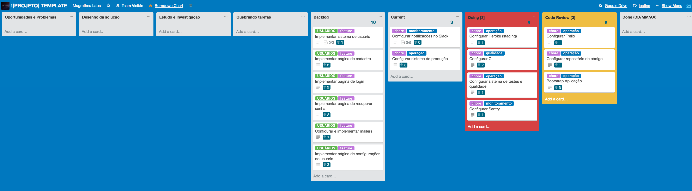

# Projetos

Nós trabalhamos com startups e grandes empresas para desenvolver produtos de software, serviços e plataformas abrangendo todas as fases do processo de desenvolvimento de software, da idealização para a escalabilidade dos sitemas e suporte de longo prazo.

Nós adotamos os princípios do Lean Thinking, ou seja, eliminamos tarefas desnecessárias, incentivamos as decisões informadas a serem feitas o mais tarde possível e entregamos o mais rápido possível. Nós capacitamos as equipes para tomar suas próprias decisões e tomarem a propriedade de desenvolvimento.

Nós também acreditamos no desenvolvimento de software [ágil](http://agilemanifesto.org), Kanban e princípios de XP para todos os projetos e ás vezes adotamos o Scrum. A grande parte das nossas práticas de desenvolvimento estam detalhdas nos livros [Extreme Programming Explained: Embrace Change](https://www.goodreads.com/book/show/67833.Extreme_Programming_Explained) (Kent Beck's) e [Clean Code](https://www.goodreads.com/book/show/3735293-clean-code) (Uncle Bob's). Nós usamos as práticas, descobrindo que usar a maioria deles melhora a qualidade do nosso trabalho.

Um dos nossos principais objetivos de processo é fazer entregas pequenas frequentemente do software funcional. Fazemos isso através de comunicação frequente e, pelo menos, com interações semanais no produto.

## Configuração

A mudança é algo onipresente no desenvolvimento de software. Este é o motivo pelo qual acreditamos que nenhum processo de desenvolvimento de software é perfeito. Adotamos a mudança, estando sempre concientes dos nossos processos atuais e buscando melhorias contínuas em todas as etapas.

Nós usamos [Kanban](https://en.wikipedia.org/wiki/Kanban_(development)) para ajudar-nos a desenvolver e evoluir nossos processos e o STATIK (sigla para *Systems Thinking Approach to Introducing Kanban*) para guiar nossas implementações e revisões do Kanban. O STATIK é um processo iterativo de 8 etapas que pode ser resumido como:

1. Entenda o que torna o serviço adequado para o propósito do cliente
2. Entenda as fontes de insatisfação
3. Analise a demanda
4. Analisar capacidade
5. Modelar o fluxo de trabalho
6. Descubra classes de serviço
7. Projetar sistemas kanban
8. Socialize o design e negocie a implementação

Sempre procuramos exercitar isso com todos os nossos colaboradores e clientes, capturando várias perspectivas para obter uma sólida compreensão dos problemas, processos e regras.

## Planejamento

> Planos não são nada; Planejamento é tudo
>  — *Dwight D. Eisenhower* (Tradução literal)

Escrever planos para projetos é importante. Em qualquer forma e tamanho, um plano fornece uma estrutura para organizar os caminhos neurais em sua mente e disponibilizar as informações brutas de maneira acessível para o restante da equipe, de modo a ter uma referência futura.

No entanto, não se atenha a um plano. Um plano de projeto não captura tudo. As mudanças acontecem o tempo todo e, infelizmente, um plano geralmente não capta a aleatoriedade da vida.

> Tudo no software muda. Os requisitos mudam. O design muda. O negócio muda. A tecnologia muda. A equipe muda. Os membros da equipe mudam. O problema não está mudando porque a mudança vai acontecer; O problema, ao contrário, é nossa incapacidade de lidar com a mudança.
>  — *Kent Beck*, Extreme Programming Explained (Tradução literal)

## Documentação

A comunicação clara é o núcleo do nosso processo de desenvolvimento. Acreditamos que é uma questão de documentação adequada para registrar todas as etapas do caminho ao fazer o software. Uma documentação adequada permite que o software seja facilmente mantido por outros e até por nós mesmos quando lidamos com código que foi feito há algum tempo.

No entanto, ter uma boa documentação não significa que iremos escrever longos comentários ao lado de cada linha de código. Além disso, isso não significa que teremos mensagens longas nos commits explicando cada pequena mudança no software. Portanto, a documentação deve ser feita na quantidade certa e de maneira organizada.

Para nós, um código bem escrito é uma boa documentação por si só. A suíte de testes automatizados também devem fornecer informações aos engenheiros e responder às perguntas sobre como o software funciona. Se houver algo que não possa ser entendido a partir do código, boas mensagens de Commits e Pull Requests bem documentadas devem fornecer as respostas. Além disso, as tarefas do board são vinculadas nas Solicitações de Pull Request e, ao examiná-las, podemos entender o que o cliente solicitou.

Todos os projetos também possuem alguns documentos de acompanhamento:

* [Proposta Comercial](https://docs.google.com/document/d/1sESbIJ_I53wYpENJo8iZU5TcdfZK8tZlzEwkfzPj4_w/edit)
* [Projeto](https://docs.google.com/a/magrathealabs.com/document/d/1IU_-NaHIaXniNpa-qpl_55tIdeLmi5TYVDpbrSTc-jk/edit)
* [Contrato](https://docs.google.com/a/magrathealabs.com/document/d/1Xhk0-s2k5ONhC2Z8gpXpPzlFagnDH7Y7D208jq-D69U/edit)
* [Termo de Conclusão do Projeto](https://docs.google.com/document/d/1KF3qVysLKTRBIS8-f6dxW64N-HyatC_UplUtzBDyrwM/edit)
* [Acordo de Não Divulgação](https://docs.google.com/document/d/1lY-N5sT8BX-YWKflEqt-m1HPdY5rzS02g1cIB6WtSfE/edit)

Iniciamos o projeto com a Proposta Comercial, com uma visão ampla das estimativas e custos do projeto. Escrevemos este documento para começar a negociar com nossos clientes. Em seguida, escrevemos o Projeto, com os requisitos iniciais e as especificações funcionais. O documento do projeto está anexado ao Contrato. Ao finalizar um projeto, damos ao cliente o Termo de Conclusão de Projeto, onde listamos o que fizemos e pedimos feedback sobre o nosso trabalho. Em alguns projetos, também usamos um documento específico para Acordo de Não Divulgação.

## Métodos

Nosso processo garante [ciclos de desenvolvimento curtos e testados pelo usuário](http://www.extremeprogramming.org/rules/releaseoften.html), facilitando a integração do feedback do cliente. Também nos permite voltar rapidamente ao curso e construir com as novas informações.

Nosso processo de desenvolvimento de software mistura cerimônias e práticas de XP, Scrum e Kanban. Regularmente, refletimos sobre como nos tornar mais eficientes, ajustando nosso comportamento de acordo a aprimorar o processo. Buscamos um ambiente e cultura motivadora, onde todos confiam uns nos outros para receber feedback construtivo e realizar o trabalho.

Acreditamos que isso evita a criação de um ambiente orientado a tarefas e favorece um ambiente orientado para a missão. Um ambiente orientado a tarefas é aquele em que os membros da equipe têm apenas uma visibilidade do trabalho que estão realizando naquele momento, sem ver as implicações de seu trabalho como um todo. Isso impõe que os desenvolvedores mantenham filas de trabalho individuais e que um gerente seja responsável por centralizar as decisões sobre o que deve ser feito.

Ao criar um ambiente orientado para a missão, temos uma única fila de trabalho em seu processo de desenvolvimento, que melhorará a utilização dos recursos disponíveis, diminuindo o tempo de entrega das demandas que passaram pelo fluxo e coletando feedback mais rápido sobre o que está sendo construído.

Ao favorecer um ambiente orientado para a missão, mudamos a pergunta "O que devemos fazer agora?" para "O que precisamos alcançar?" Assim, o esforço dos membros da equipe é direcionado para resolver os problemas que realmente importam em um determinado momento, em vez de apenas entregar as demandas recebidas de alguém.

Enquanto um ambiente orientado a tarefas faz com que os desenvolvedores se preocupem apenas com seu próprio trabalho, um ambiente orientado à missão faz com que os desenvolvedores se concentrem no panorama geral. Isso ajuda os desenvolvedores a identificar gargalos no processo e trabalhar de forma proativa para resolvê-los, como revisar código de colegas ou fazer par de programação para trabalhar em uma tarefa difícil.

Este é um exemplo do quadro Trello de um projeto comum:

    
    [Projeto Template](https://trello.com/b/OzLyn6bx/projeto-template).

O board é organizado de forma que todo o fluxo, de idéias (upstream) a desenvolvimento (downstream) seja visível para todos os membros da equipe. Concentrar-se apenas na eficácia upstream (board de ideias) aumenta o risco de desbalanceamento do board downstream (pedidos de execução excessivos). Sem eficácia no board downstream, é necessário confiar cegamente no upstream para evitar tarefas que não geram valor no fluxo de demandas.

Como você pode ver, a lista de Doing (em vermelho) e a lista de Code Review (em amarelo) têm limites de cards. Isso significa que há muitas tarefas no Work in Process na lista Doing e estamos no limite de tarefas na lista Code Review. Isso nos ajuda a manter a quantidade de trabalho em andamento pequena, tornando o foco em ajudar os outros membros da equipe a concluírem a tarefa ou revisar os Pull Requests abertos.

## Gerenciamento de Projeto

Gostamos de trabalhar em fases, interagindo com os clientes para priorizar, testar e aprender sobre o que estamos fazendo. Implementamos os POCs para explorar o potencial de nossas ideias, para que possamos nos concentrar em um particular para construir o MVP, escalonando os que funcionaram:

[Reference: Thoughtworks](https://www.thoughtworks.com/insights/blog/10-tips-transformation-guide-pioneers)

Nossos projetos de software são gerenciados no [Trello](https://trello.com). Em nossa experiência, o Trello é uma ferramenta flexível na qual desenvolvedores, gerentes de produto, designers e clientes podem trabalhar juntos.

Esse espaço é usado para especificar histórias de usuários, escrever sobre oportunidades para melhorar o software, problemas que devem ser resolvidos, design de soluções, recursos e bugs (incluindo todas as etapas para reproduzi-los) e outras discussões que devem acontecer antes da codificação.

Para cada feature, escrevemos uma história com um subconjunto de tarefas. Nós sempre tentamos quebrar as histórias nas menores peças possíveis para entregar valor ao usuário do sistema.

As histórias devem ser compreensíveis por todos da equipe, incluindo designers, PMs (Project Managers) e POs (Project Owners). Podemos criar algumas histórias que são muito técnicas, mas isso é uma exceção; a regra deve ser "toda história deve ter todas as informações necessárias para ser entendida por qualquer pessoa".

### Estimativas

As histórias são estimadas usando a seqüência de Fibonacci:

* **0 pontos**: trivial (~10 minutes)
* **1 ponto**: 1/4 dia de trabalho
* **2 pontos**: 1/2 dia de trabalho
* **3 pontos**: 1 dia de trabalho
* **5 pontos**: 2~3 dias de trabalho (Espera-se que seja quebrada em mais tarefas)
* **8 pontos**: 1 semana de trabalho (Espera-se que seja quebrada em mais tarefas)

Estimamos as histórias antes de começar e depois de terminá-las. Desta forma, podemos acompanhar quão boas são as nossas estimativas e melhorá-las nos próximos sprints.

Estamos usando o plug-in [Scrum for Trello](https://chrome.google.com/webstore/detail/scrum-for-trello/jdbcdblgjdpmfninkoogcfpnkjmndgje) para nos ajudar a estimar as histórias no Trello.

### Software de gerenciamento de projetos

Aqui, descrevemos o processo de uso do Trello, mas o processo geral permanece relativamente semelhante em diferentes sistemas. Não há dois produtos iguais, portanto, a flexibilidade no processo de desenvolvimento do produto é importante. Trello responde bem a mudar a estrutura do processo “on the fly”. Um quadro Trello é um equivalente de software de um quadro Kanban físico.

Geralmente, nossos quadros incluem as seguintes listas:

* Opportunities and problems (Oportunidades e problemas)
* Solution design (Projeto da solução)
* Breaking down stories (Quebrando histórias)
* Backlog (Lista de pendências)
* Current Sprint (Sprint atual)
* Doing (Fazendo)
* Code Review (Revisão de código)
* QA Review (Qualidade)
* Ready for Production (Pronto para produção)
* Done (Feito)

Em alguns projetos, também temos a lista de "Support" (Suporte) ao lado de "Current Sprint", onde adicionamos um trabalho de suporte urgente que deve ser tratado o mais rapidamente possível pelo colega de equipe que está usando o chapéu de suporte. Toda semana o chapéu de apoio deve estar com um colega de equipe diferente.

"Opportunities and problems" e "Solution design" pertencem ao upstream, onde o time de produto e design, junto a equipe do cliente, trabalham para priorizar o trabalho e projetar a solução.

A lista "Backlog" é a única lista priorizada a que a equipe do produto se refere para saber o que trabalhar em seguida. Um card representa uma história de usuário, correção de bug ou tarefa de engenharia.

Depois que os cards na lista de Backlog forem priorizadas, elas estarão prontas para a execução. Um membro do projeto atribui-se e puxa para a lista "Doing". As cartas na lista de "Doing" estão sendo ativamente desenvolvidas. Você não pode estar atribuido em mais de um card na mesma etapa.

Quando o desenvolvedor cria um Pull Request para a branch de funcionamento, ele move o cartão para a lista de Code Review. Qualquer revisor atribui seu rosto no cartão enquanto revê-lo. Não há afunilamento para mesclar na master: todos podem fazer isso.

Os cartões na lista "QA Review" são implantados no staging. O criador do cartão e, em alguns casos, o cliente revisa a nova funionalidade. Não há afunilamento para implantação em teste: todos podem fazer isso.

A lista "Ready for Production" inclui cartões que foram aceitos no staging e estão prontos para serem implantados. Não há gargalo para liberar para produção: todos podem fazê-lo. Os cartões nas listas "Done" já estão liberados em produção. Cada semana tem sua própria lista "Done" para que possamos acompanhar o que foi lançado em determinado período.

Estes são alguns plugins essenciais do Chrome / Firefox que usamos atualmente:

#### [Trelabels](https://github.com/fredericseiler/trelabels)

Para melhores rótulos no trello.

#### [TrelloWIPLimits](https://github.com/NateHark/TrelloWIPLimits)

Adiciona limites de trabalho em andamento às listas do Trello que suportam um fluxo de trabalho Kanban. Para adicionar limite de WIP (Work in Progress) em uma lista, inclua o limite entre chaves no título da lista (por exemplo, `Revisão de código [4]`). Quando o número de cartões na lista exceder o limite, o fundo da lista ficará vermelho.

#### [Scrum for Trello](https://chrome.google.com/webstore/detail/scrum-for-trello/jdbcdblgjdpmfninkoogcfpnkjmndgje)

Adiciona funcionalidade para uso em projetos Scrum. Você pode adicionar estimativas adicionando `(N)` no início do título do cartão e os pontos consumidos no final usando `[N]`.