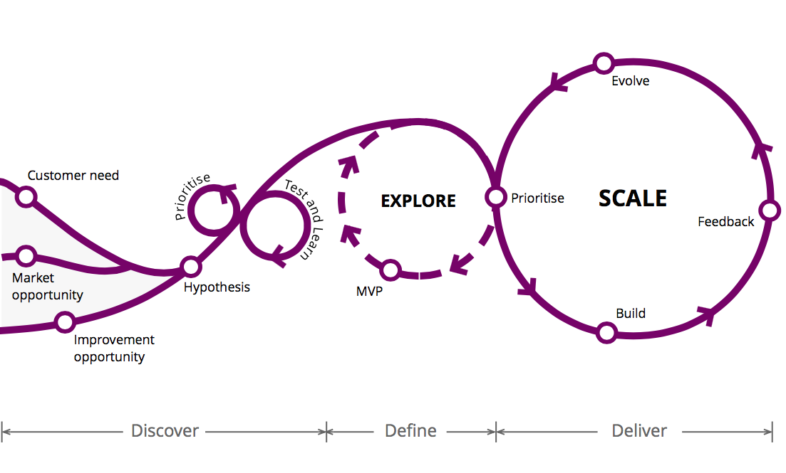

# Projects

We work following some [Agile](http://agilemanifesto.org) practices. Most of our
development practices are detailed in the Kent Beck's
[Extreme Programming Explained: Embrace Change](https://www.goodreads.com/book/show/67833.Extreme_Programming_Explained) and Uncle Bob's [Clean Code](https://www.goodreads.com/book/show/3735293-clean-code)
books. We have tried their practices and found that using most of them improves
the quality of our work.

## Project Planning

!!! quote
    Plans are nothing; planning is everything
     — *Dwight D. Eisenhower*

!!! quote
    [...] as we know, there are known knowns; there are things we know we know. We also know there are known unknowns; that is to say we know there are some things we do not know. But there are also unknown unknowns - the ones we don't know we don't know [...]
     — *[Donald Rumsfeld](https://www.wikiwand.com/en/There_are_known_knowns)*

!!! quote
    Everything in software changes. The requirements change. The design changes. The business changes. The technology changes. The team changes. The team members change. The problem isn't changing because change is going to happen; the problem, rather, is our inability to cope with change.
     — Kent Beck, Extreme Programming Explained

Writing plans for projects is important. In any form and size, a plan provides a
framework to organize the neural pathways in your mind and to make the raw
information available in an accessible way to the rest of the team in a way to
have a future reference.

However, do not stick to a plan. A project plan does not capture everything.
Changes happen all the time and, unfortunately, a plan usually fails to capture
the randomness of life.

## Documentation

Clear communication is a core of our development process. We believe it is a
matter of proper documentation to register all steps of the way when making
software. A proper documentation allows software to be easily maintainable by
others and even by ourselves when we deal with code that was made some time ago.

However, to have a good documentation does not mean we will write long comments
at the side of each line of code. Moreover, it does not mean we will have long
messages in the commits explaining each little change in the software. Therefore
the documenting must be done at a right amount and in an organized manner.

All our projects are specified in PRDs (Product Requirement Documents) in our
[Google Drive Projects folder](https://drive.google.com/drive/folders/0B6m7dowklNjvUTVIcURiazBoM2s).

All projects have some accompaniment docs:

* [Commercial Proposal](https://docs.google.com/document/d/1sESbIJ_I53wYpENJo8iZU5TcdfZK8tZlzEwkfzPj4_w/edit)
* [Project](https://docs.google.com/a/magrathealabs.com/document/d/1IU_-NaHIaXniNpa-qpl_55tIdeLmi5TYVDpbrSTc-jk/edit)
* [Contract](https://docs.google.com/a/magrathealabs.com/document/d/1Xhk0-s2k5ONhC2Z8gpXpPzlFagnDH7Y7D208jq-D69U/edit)
* [Project Completion Term](https://docs.google.com/document/d/1KF3qVysLKTRBIS8-f6dxW64N-HyatC_UplUtzBDyrwM/edit)
* [NDA](https://docs.google.com/document/d/1lY-N5sT8BX-YWKflEqt-m1HPdY5rzS02g1cIB6WtSfE/edit)

We start the project with the commercial proposal, with a broad vision of the
project's estimates and costs. We write this document to start negotiating with
our customers. Then, we write the project, with requirements and functional
specs. The project document is attached to the contract. When finishing a
project, we give to our customer the project completion term, where we list
what we have done and ask for feedback about our work. In some projects, we also
use a particular NDA document.

## Project Management

We like to work in phases, iterating with customers to prioritize, test and
learn about what we're doing. We implement POCs to explore the potential of our
ideas, so we can focus on a particular one to build the MVP, scaling the ones
that worked:

[Reference: Thoughtworks](https://www.thoughtworks.com/insights/blog/10-tips-transformation-guide-pioneers)

Our software projects are managed on [Trello](https://trello.com). In our
experience, Trello is a flexible tool where developers, product managers,
designers and customers can work together.

This space is used to specify users stories, write about oportunities to improve
the software, problems we should solve, design of solutions, features and bugs
(including all steps to reproduce them), and other discussions that must happen
before coding.

For each feature, we write a story with a subset of tasks. We always try to
break the stories in the smallest possible pieces to deliver value to the user
of the system.

Stories should be understandable by everyone on the team, including designers,
PMs (Project Managers) and POs (Project Owners). We may create some stories that
are too technical, but this is an exception; the rule should be "every story
should have all the necessary information to be understood by anyone".

### Estimates

Stories are estimated using the Fibonacci sequence:

* **0 points**: trivial (~10 minutes)
* **1 point**: 1/4 day of work
* **2 points**: 1/2 day of work
* **3 points**: 1 day of work
* **5 points**: 2~3 days of work (should be split into smaller tasks)
* **8 points**: 1 week of work (should be split into smaller tasks)

### Sprints

!!! attention
    This section is missing content.

[Template project](https://trello.com/b/OzLyn6bx/projeto-template).

### Trello

These are some essential Chrome/Firefox plugins we currently use.

#### [Trelabels](https://github.com/fredericseiler/trelabels)

For better labels.

#### [TrelloWIPLimits](https://github.com/NateHark/TrelloWIPLimits)

Adds work-in-progress limits to Trello lists supporting a Kanban workflow. WIP
limit on a list, include the limit in braces in the list title (e.g.,
"Code Review [4]). When the number of cards in the list exceeds the limit,
the list background will turn red.

#### [Scrum for Trello](https://chrome.google.com/webstore/detail/scrum-for-trello/jdbcdblgjdpmfninkoogcfpnkjmndgje)

Adds functionality for use in Scrum projects. You can add estimates adding
`(NUMBER)` in the beginning of the card title and the consumed points in the end
using `[NUMBER]`.
