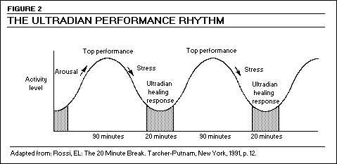

# Expanding your skill set

!!! attention
    This section can be improved.

We encourage you to keep learning and expanding your skill set. You can learn new things through (but not limited to) your investment time. We also try to include new technologies and methods in our projects and daily routines.

## Sustainable pace

Working in a sustainable pace helps not only making estimatives more accurate, but also helps you maintain and expand your talents. This is energized work - which roughly means making sure you're in your best shape to enter a focused state (which also means not overworking yourself).

## Power hours

A good way to find out your [most productive hours](https://blog.trello.com/find-productive-hours) is following your ultradian rhythms. Almost everyone's attention oscillate in intervals of 90-120 minutes followed by 20 minutes of rest. This is known as BRAC (basic rest-activity cycle).

[Reference: The 20 Minute Break](http://www.mentalhealth.com/mag1/p51-str.html)

We also recommend using [pomodoro techniques](https://en.wikipedia.org/wiki/Pomodoro_Technique) along with pair programming within your attention intervals to leverage your top performance.

## Flow Theory

All of the above can fall under the umbrella of the Flow Theory.

[Reference: Mihály Csíkszentmihályi](https://en.wikipedia.org/wiki/Flow_(psychology))

[Flow](https://en.wikipedia.org/wiki/Flow_(psychology)) is an optimal mental state where skill and challenge levels are adjusted to achieve balance. It is an important aspect of learning and it provides a good heuristic to determine what you can and can't do. If you're feeling anxious or bored, talk to your teammates to help you find what are the most appropriate tasks for you right now.
