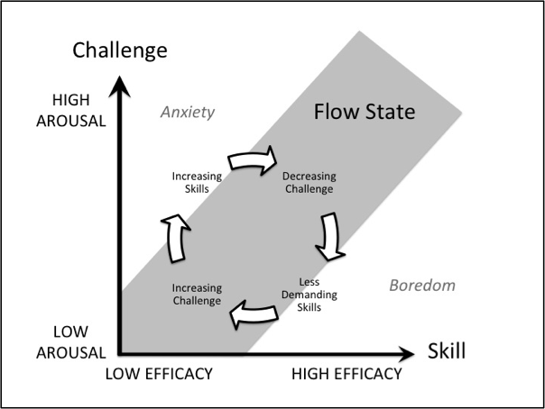

# Personal development

!!! attention
    This section can be improved.

We always encourage everyone to keep learning and developing their talents. This usually means studying, experimenting and sharing. We incentivise this with our investiment time e.g. Brown Bag Lunch, Hackday, participating in meetups, workshops and conferences, taking online courses, writings blogposts and giving talks. We also try to include new technologies and methods in our projects to try and give everyone opportunities to learn.

## Flow Theory

The [Flow Theory](https://en.wikipedia.org/wiki/Flow_(psychology)) provides good heuristic to help you balance out your challenges and skills.

[Reference: Mihály Csíkszentmihályi](https://en.wikipedia.org/wiki/Flow_(psychology))

**Flow**, a.k.a. being in **the zone**, is a mental state where you perform an activity fully immersed, highly energized and with enjoyment. In this context, feeling too bored or too anxious can be a sign that your challenges are not well-adjusted to your skills. If you're having these feelings, you can talk to your teammates to try and find out what are the most appropriate tasks for you right now.

This heuristic goes hand in hand with [some XP practices like energized work](https://blog.magrathealabs.com/a-brief-jouney-into-xp-and-its-3-main-pillars-120802ce1814).

## Sustainable pace

Energized work roughly means making sure you're in your best shape to enter a focused state. Which also means not working overtime or coming to work with the flu. Don't get fooled into thinking that working more hours will make you more produtive. Intensity without consistency and principles is unsusteinable and leads to unpredictability.

This is very important when you're trying to find a [sustainable pace](extremeprogramming.org/rules/overtime.html), but also helps you to overcome your challenges, expands your skills and keep morale up.

## Power hours

When you have solid principles and consistency, you can increase intensity without the bad side effects. A good way is to find out your [most productive hours](https://blog.trello.com/find-productive-hours) and [avoid too much task switching](https://en.wikipedia.org/wiki/Task_switching_(psychology)#Switch_cost). We also recommend using [pomodoro techniques](https://en.wikipedia.org/wiki/Pomodoro_Technique) and/or [pair programming](http://www.extremeprogramming.org/rules/pair.html) to leverage your top performance.
