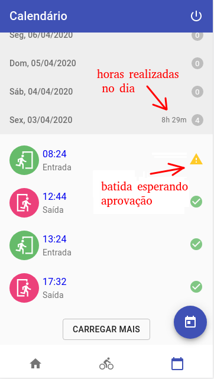

# Horas de trabalho

Trabalhamos em um [ritmo sustentável](http://www.extremeprogramming.org/rules/overtime.html). Planejamos nosso trabalho de uma forma pragmática, mantendo expectativas realistas com nossos clientes sobre nossas entregas. Isso não significa que não nos empenhamos. Ser produtivo é parte fundamental para mantermos a confiança que nossos clientes têm em nós, por isso é importante não decepcioná-los.

Trabalhamos entre 6 e 6,5 horas por dia para nossos clientes em desenvolvimento de software ou consultoria, e 1,5 horas em [horas de investimento](https://thoughtbot.com/playbook/our-company/time). Quando tiramos um tempo de folga durante um trabalho de cliente, discutimos com o time como isso irá afetar nosso planejamento.

Somos flexíveis em relação a que horas começamos a trabalhar. Horas flexíveis significa que às vezes trabalhamos em horários não tradicionais durante o dia. Alguns começam às 8:00, outros às 10:00, e até mesmo às 13:00. É claro, essa flexibilidade deve respeitar as demandas dos nossos clientes.

Devemos tentar ter pelo menos 3 horas por dia onde o horário de todos se sobrepõe, para termos uma comunicação síncrona durante esse período. Atualmente esse horário está definido como sendo entre **14:00 e 17:30**.

## Horas de investimento

Esse é um tempo que tiramos para investir em nós mesmos, na empresa ou na comunidade. Usamos esse tempo para aprender coisas novas, ler, contribuir para projetos _open source_, discutir sobre coisas interessantes, participar ou organizar eventos para a comunidade, preparar ou escutar palestras e eventos internos. Esse tempo é muito importante para nós pois a indústria de _software_ está em evolução constante e queremos nos manter sempre atualizados e em constante aprimoramento. Este é um tempo que temos para deliberadamente executar nosso processo de melhoria contínua.

Nós organizamos nossas projetos no quadro [Hacking](https://trello.com/b/ZrBmPW5n/mlabs-hacking).

Ideias para as horas de investimento:

* Contribuir para um projeto _open source_;
* Ler um livro;
* Escrever um _blog post_;
* Preparar uma palestra interna, _meetup_ ou uma palestra para conferência;
* Ajudar na organização de um _meetup_ local;
* Ajudar a melhorar os processos internos da Magrathea, revisando nossas documentações;
* Fazer _pair programming_ com colegas de trabalho para ensinar e aprender coisas.

### Kindle

Temos kindles na empresa. Qualquer pessoa com um endereço [@magrathealabs.com](@magrathealabs.com) pode enviar pdfs e outros formatos para [kindle.magrathea.1@Kindle.com](kindle.magrathea.1@Kindle.com). O número 1 pode ser substituído pelo número do dispositivo. A sincronização está desativada para evitar que a leitura de uma pessoa atrapalhe a de outra. Também podemos emprestar livros da conta da Magrathea para a conta pessoal de alguém, fale com o pessoal da empresa para saber como fazer isso. Para mais detalhe sobre como enviar documentos, acesse a [documentação do Kindle](https://www.amazon.com/gp/sendtokindle/email).

## Trabalho remoto

Mantenha em mente que quando uma pessoa do time está trabalhando remotamente, ela não está no escritório para ouvir o que está sendo discutindo com outras pessoas do time. Se uma pessoa do time estiver remota, todo o time deve trabalhar como se estivesse remoto.

Quando estiver trabalhando remotamente, comunique-se o máximo que puder. Todas as decisões sobre o projeto devem ser comunicadas no canal do projeto no Slack ou descritas em um documento online onde todos podem contribuir. Desse modo, evitamos que pessoas que estão trabalhando em um lugar ou horário diferente tenham seu trabalho bloqueado por falta de alinhamento.

Evite comunicar-se em canais privados ou através de mensagens diretas. Lembre-se, _somos um time_ e _somos ativamente transparentes_. Quando usamos comunicação assíncrona no projeto é esperado que não tenhamos uma resposta imediata.

Se você não está no escritório, sempre deixe ativadas as notificações do canal do projeto no Slack para saber o que está acontecendo no projeto. Assim, você receberá notificações de todas as ferramentas que usamos: _Github_, _New Relic_, _Heroku_, _AWS_, _Log Entries_, _Sentry_ and _Circle CI_.

## Feriados e férias

Geralmente tiramos 14 dias de férias coletivas no final do ano para o Natal e Ano Novo. Também folgamos nos feriados nacionais. Caso queira tirar mais alguns dias de folga, primeiro converse com seu time para discutir como isso irá afetar o projeto, e então fale com o Alan ou a Alissa sobre a sua folga.

## Apontamento das horas

Temos dois tipos de apontamento na Magrathea. Um é o ponto padrão, requerido pela CLT, pelo sistema DalePonto. O outro, é o apontamento dos projetos no Toggl.

### DalePonto

Utilizamos para controle de batidas um sistema interno, que está em desenvolvimento. Ele é uma aplicação PWA o que possibilita a utilização como aplicativo no celular.

Link para o app: https://ponto-app.magrathealabs.io/
Link para o admin: https://ponto-admin.magrathealabs.io/

Para ter acesso consulte o Carlos para que ele realiza seu cadastro na sistema.

#### Utilização

**Tela inicial**

Nesta tela você pode ver as informações que você precisa na rotina de batida de ponto diária e realizar as principais funções relacionadas.

Ainda na tela inicial você pode bater um ponto da seguinte forma:

Ou invalidar uma batida:

Batida também podem ser invalidadas na tela de histórico de batidas, da mesma forma como demonstrado acima.

**Tela de Ajustes**

Nessa tela é possível pedir um ajuste de pontos, como abaixo:

**Histórico de Batidas**

Nesta tela é possível conferir as batidas e algumas outras informações úteis sobre o dia. Abaixo mostramos um exemplo, quando um dia possui um número ímpar de batidas válidas:

E aqui um dia com o número de batidas válido:

Existem duas formas para navegar pelos dias: a primeiro é apertando no botão de `Mostrar mais`:

E o segundo é selecionando o calendário e clicando no dia desejado:

Se ainda restarem dúvidas, você pode saná-las buscando o mestre Carlos no Slack.

### Toggl

Usamos o [Toggl](https://www.toggl.com) para gerenciar quanto tempo estamos nos dedicando em cada projeto.

#### Criando projeto

1. [Criar cliente](https://toggl.com/app/workspaces/1954462/clients) caso ele ainda não exista;
2. [Criar projeto](https://toggl.com/app/projects/1954462/list/status/active/billable/both/page/1), definindo:
    * Project name (deve possuir o número de contrato e descrição do projeto);
    * Client;
    * Color (primeiro azul disponível);
    * Billable (colocar custo por hora para escopo aberto ou estimativa para escopo fechado);
    * Manual estimation (apenas para escopo fechado).

#### Finalizando projeto

1. Adicionar cada pessoa que participou do projeto na aba “Team”, indicando os seus respectivos “Rate” e “Labor Cost” — precisamos definir desse modo para evitar que mudanças salariais e de cobrança alterem relatórios antigos. Simplesmente usem o mesmo valor que o global;
2. Arquivar projeto.

#### Boas práticas do Toggl

Dê uma olhada nas tarefas pré-definidas nos projetos para verificar se alguma coisa se relaciona com o que você está apontando.

Não descreva seus apontamentos como "_code review_", "_pair programming_", "ajudando alguém" ou "reunião", pois isso não é muito informativo. É melhor colocar o nome da tarefa que você está trabalhando no momento. Para ficar consistente, aponte no Toggl o mesmo nome da tarefa presente no Trello ou título do PR no GitHub.

Quando apontar uma reunião no Toggl, selecionamos o cliente com a task "Reunião" e deixe claro na descrição qual é a reunião em que está participando. Exemplo: "Reunião de planejamento de sprint".

Se você tiver TOC, pode arredondar o tempo em 5 minutos (mais ou menos) para ficar tudo bonitinho.
